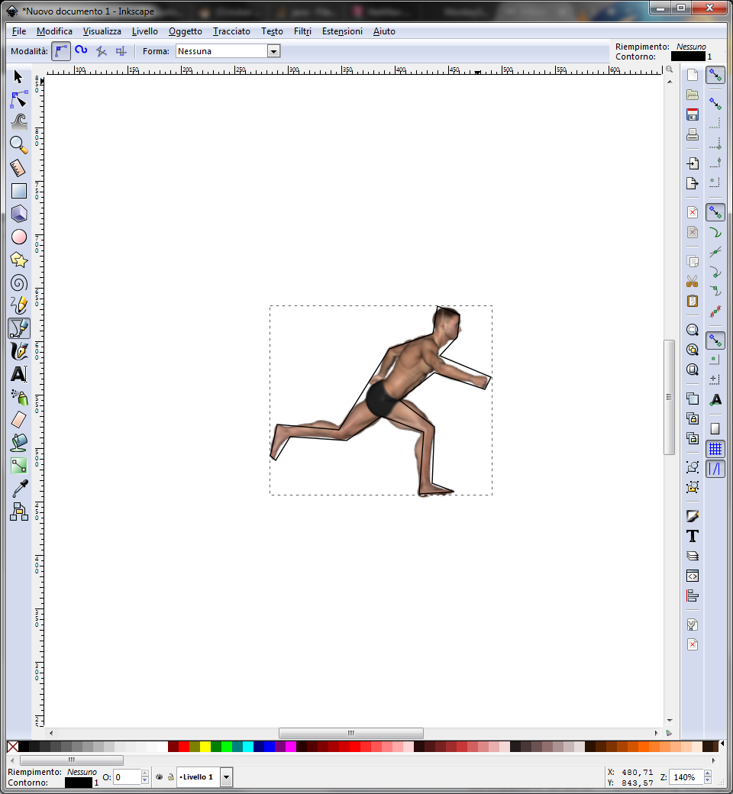
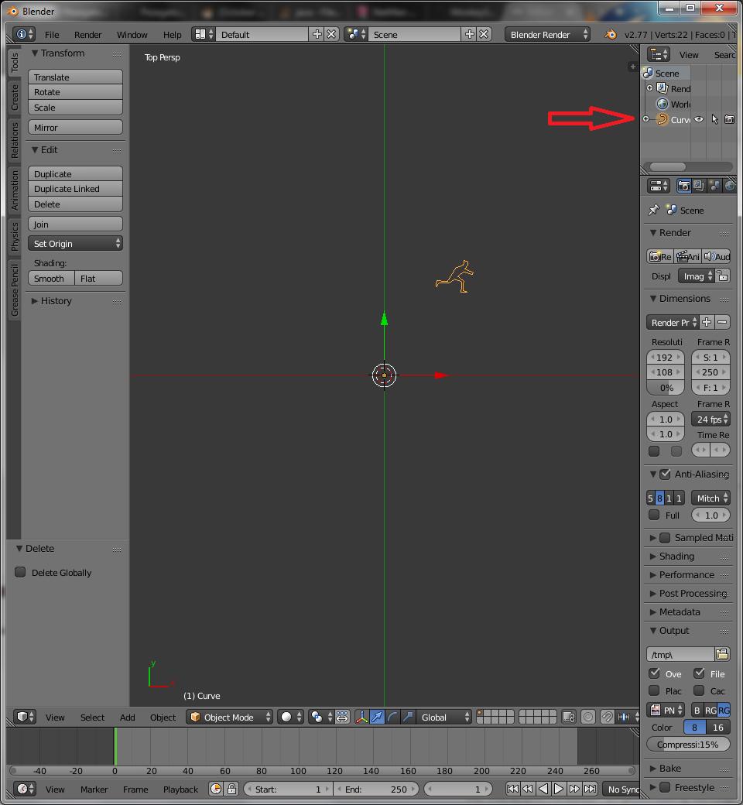
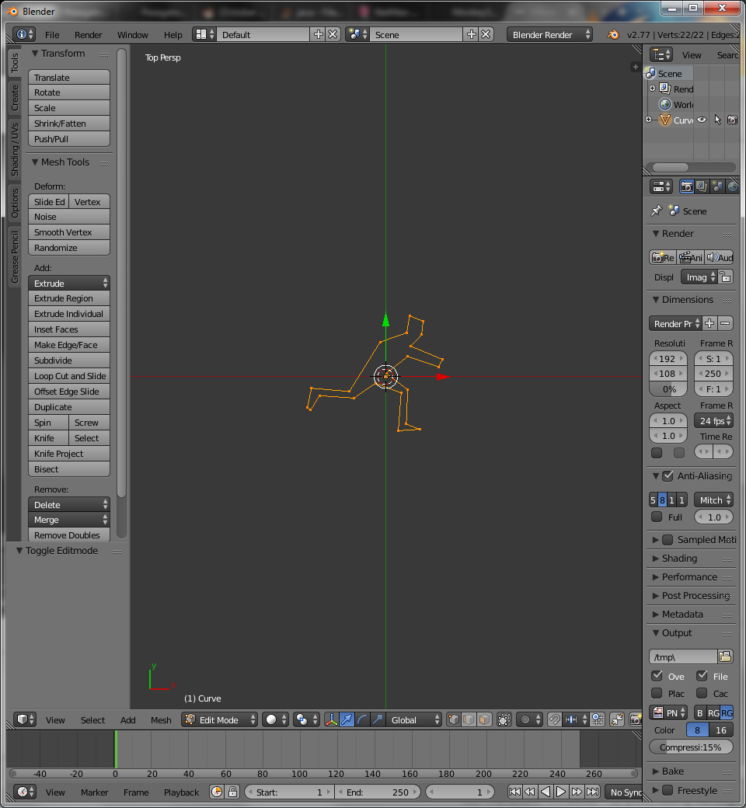

# Hitbox building
Open Inkscape (tested on Inkscape 0.91 r13725) and drag and drop your sprite.
Press `Shift-F6` or select "draw straight line" tool. Now draw a polyline of your hitbox.

Now save the .svg
Run blender (tested on Blender 2.77a). Remove cube, camera and lights.
File -> Import -> .svg (select the .svg you just created).

To have a better view, press 7 and scroll with the mouse wheel.

Click "Curve" on the scene tab

Press `Ctrl-Alt-Shift-C` or click "Set Origin", then "Geometry to Origin".

Press `Alt-C` then "(Convert to) Mesh from Curve"

Enter edit mode by pressing `TAB`

Select all vertices by keeping pressed `Ctrl` while you draw an enclosing shape with left mouse button.

Press `F`, then save the .blend file.

To make a horizontally flipped version, press `s`,`x`, then `-1` and `Enter`, then save the .blend file.

Put each blend file inside a jMonkeyEngine project. Right click on it and select "Convert to .j3o".

Now run the Trianglizer (TODO). Enjoy!